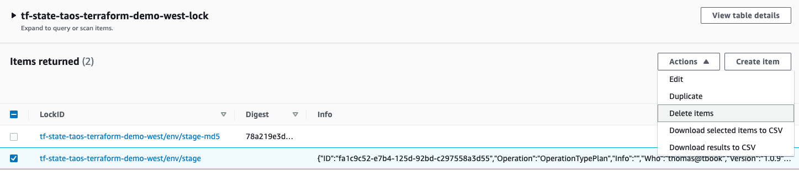

# unlock a dynamo-db table

A DynamoDB table is used to lock the Terraform state file in the S3 bucket so that only one engineer may build infrastructure at a time. Sometimes this table seizes up, and it must be unlocked. This usually happens because the builder did a CTRL+C to abort a `make plan` or `make apply` operation. It looks like this: 

```shell
% make plan
terraform plan -no-color -out=/tmp/dish-stage-orchestrator.plan 2>&1 | \
	tee /tmp/tf-dish-stage-orchestrator-plan.out
Acquiring state lock. This may take a few moments...

Error: Error acquiring the state lock

Error message: ConditionalCheckFailedException: The conditional request
failed
Lock Info:
  ID:        2068c5a0-aec0-b5fd-d7ed-00ac184795db
  Path:      tf-state-taos-terraform-demo-west/env/stage
  Operation: OperationTypePlan
  Who:       userName@hostName
  Version:   1.0.9
  Created:   2021-11-14 23:06:32.777497 +0000 UTC
  Info:      

Terraform acquires a state lock to protect the state from being written
by multiple users at the same time. Please resolve the issue above and try
again. For most commands, you can disable locking with the "-lock=false"
flag, but this is not recommended.
```

```shell
% cat provider-aws.tf
terraform {
...
  backend "s3" {
    dynamodb_table = "tf-state-taos-terraform-demo-west-lock" <- tableName
    bucket         = "tf-state-taos-terraform-demo-west"
    key            = "env/stage"                       <- keyName
    region         = "us-west-2"
...
```

Navigate to the DynamoDB page > Items > `$tableName`: check the box that corresponds to `$keyName`

Select Action > Delete



That's it; re-attempt the `make plan/apply`. It should work now.
